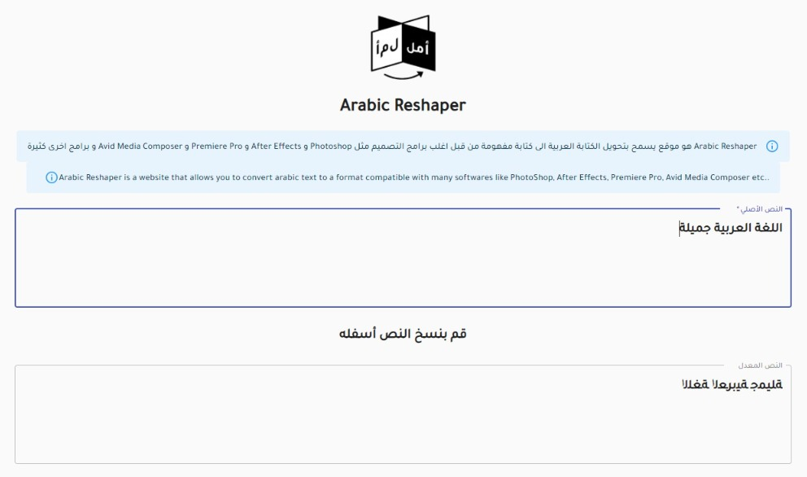

<!--
*** Thanks for checking out the Best-README-Template. If you have a suggestion
*** that would make this better, please fork the repo and create a pull request
*** or simply open an issue with the tag "enhancement".
*** Thanks again! Now go create something AMAZING! :D
***
*** https://github.com/othneildrew/Best-README-Template/edit/master/BLANK_README.md
***
-->


<!-- PROJECT SHIELDS -->
<!--
*** I'm using markdown "reference style" links for readability.
*** Reference links are enclosed in brackets [ ] instead of parentheses ( ).
*** See the bottom of this document for the declaration of the reference variables
*** for contributors-url, forks-url, etc. This is an optional, concise syntax you may use.
*** https://www.markdownguide.org/basic-syntax/#reference-style-links
-->
[![Contributors][contributors-shield]][contributors-url]
[![Forks][forks-shield]][forks-url]
[![Stargazers][stars-shield]][stars-url]
[![Issues][issues-shield]][issues-url]
[![MIT License][license-shield]][license-url]
[![LinkedIn][linkedin-shield]][linkedin-url]


<!-- PROJECT LOGO -->
<br />
<p align="center">
  <a href="https://github.com/bilalelhoudaigui/arabic-reshaper-app">
    
  </a>

  <h3 align="center">Arabic Reshaper App (ARA)</h3>

  <p align="center">
    Reconstruct Arabic sentences to be used in applications which doesn't support Arabic
    <br />
    <a href="https://github.com/bilalelhoudaigui/arabic-reshaper-app/blob/main/README.md"><strong>Explore the docs »</strong></a>
    <br />
    <br />
    <a href="https://github.com/bilalelhoudaigui/arabic-reshaper-app">View Demo</a>
    ·
    <a href="https://github.com/bilalelhoudaigui/arabic-reshaper-app/issues">Report Bug</a>
    ·
    <a href="https://github.com/bilalelhoudaigui/arabic-reshaper-app/issues">Request Feature</a>
  </p>
</p>


<!-- TABLE OF CONTENTS -->
<details open="open">
  <summary><h2 style="display: inline-block">Table of Contents</h2></summary>
  <ol>
    <li>
      <a href="#about-the-project">About The Project</a>
      <ul>
        <li><a href="#built-with">Built With</a></li>
      </ul>
    </li>
    <li>
      <a href="#getting-started">Getting Started</a>
      <ul>
        <li><a href="#prerequisites">Prerequisites</a></li>
        <li><a href="#installation">Installation</a></li>
      </ul>
    </li>
    <li><a href="#usage">Usage</a></li>
    <li><a href="#roadmap">Roadmap</a></li>
    <li><a href="#contributing">Contributing</a></li>
    <li><a href="#license">License</a></li>
    <li><a href="#contact">Contact</a></li>
    <li><a href="#acknowledgements">Acknowledgements</a></li>
    <li><a href="#todo">TODO</a></li>
  </ol>
</details>

<!-- ABOUT THE PROJECT -->
## About The Project

<div dir="rtl">
Arabic Reshaper هو موقع يسمح بتحويل الكتابة العربية الى كتابة مفهومة من قبل اغلب برامج التصميم مثل Photoshop و After Effects و Premiere Pro و Avid Media Composer و برامج اخرى كثيرة
</div>
<br/>

<p align="center">
  
</p>

### Built With

* [React](https://reactjs.org/)
* [Material UI](https://material-ui.com/)
* [arabic-persian-reshaper](https://www.npmjs.com/package/arabic-persian-reshaper)

<!-- GETTING STARTED -->
## Getting Started

To get a local copy up and running follow these simple steps.

### Prerequisites

This is an example of how to list things you need to use the software and how to install them.

* [Git](https://git-scm.com/downloads)
* [Node.js](https://nodejs.org/en/download/)
* [Visual Studio Code](https://code.visualstudio.com/download) (Optional but highly recommended)

> The project was bootstrapped with [Create React App](https://github.com/facebook/create-react-app).

### Installation

1. Clone the repo
   ```sh
   git clone https://github.com/bilalelhoudaigui/arabic-reshaper-app.git
   ```
2. Install NPM packages
   ```sh
   npm install
   ```
3. Runs the app in the development mode.
   ```sh
   npm start
   ```
    Open [http://localhost:3000](http://localhost:3000) to view it in the browser.\
    The page will reload if you make edits, you will also see any lint errors in the console.

* Launches the test runner in the interactive watch mode.
   ```sh
   npm test
   ```
   See the section about [running tests](https://facebook.github.io/create-react-app/docs/running-tests) for more information.

* Builds the app for production to the `build` folder.
   ```sh
   npm run build
   ```
   It correctly bundles React in production mode and optimizes the build for the best performance.\
   The build is minified and the filenames include the hashes and the app is ready to be deployed!

   See the section about [deployment](https://facebook.github.io/create-react-app/docs/deployment) for more information.

#### Learn More

You can learn more in the [Create React App documentation](https://facebook.github.io/create-react-app/docs/getting-started).

To learn React, check out the [React documentation](https://reactjs.org/).

<!-- USAGE EXAMPLES -->
## Usage

As shown in the screenshot above, you can type the Arabic text in the first text box area and copy the reshaped text that appears in the text box area below (as simple as that!)

<!-- ROADMAP -->
## Roadmap

See the [open issues](https://github.com/bilalelhoudaigui/arabic-reshaper-app/issues) for a list of proposed features (and known issues).

<!-- CONTRIBUTING -->
## Contributing

Contributions are what make the open source community such an amazing place to be learn, inspire, and create. Any contributions you make are **greatly appreciated**.

1. Fork the Project
2. Create your Feature Branch (`git checkout -b feature/AmazingFeature`)
3. Commit your Changes (`git commit -m 'Add some AmazingFeature'`)
4. Push to the Branch (`git push origin feature/AmazingFeature`)
5. Open a Pull Request

<!-- LICENSE -->
## License

Distributed under the MIT License. See `LICENSE` for more information.

<!-- CONTACT -->
## Contact

Bilal El Houdaigui - [bilal.elhoudaigui@gmail.com](bilal.elhoudaigui@gmail.com)

Project Link: [https://github.com/bilalelhoudaigui/arabic-reshaper-app](https://github.com/bilalelhoudaigui/arabic-reshaper-app)

<!-- ACKNOWLEDGEMENTS -->
## Acknowledgements

* The [React team](https://reactjs.org/community/team.html) and the [guys who made and maitaining Material UI](https://material-ui.com/discover-more/team/).
* Many thanks to Shen Yiming ([@soimy](https://github.com/soimy)) and ([@JesseDrain](https://github.com/JesseDrain)) for providing the [arabic-persian-reshaper](https://github.com/soimy/arabic-persian-reshaper) module.
* [Best-README-Template](https://github.com/othneildrew/Best-README-Template): This guys are awesome!
* [GitHub Emoji Cheat Sheet](https://www.webfx.com/tools/emoji-cheat-sheet/) and [https://gist.github.com/parmentf/035de27d6ed1dce0b36a](Git Commit message Emoji) :simple_smile:

<!-- TODO -->
## TODO

* :sparkles: Features:
  * [x] Add Material UI and Arabic font ([Tajawal](https://fonts.google.com/specimen/Tajawal))
  * [x] Reshap Arabic text while typing (live reshap)
  * [ ] Add Dark Theme
  * [ ] Add 'copy to clipboard' 
    * See [this one](https://stackoverflow.com/a/42844911/4488332) or [this one looks future-proof(er)](https://stackoverflow.com/a/62404717/4488332)

* :rocket: Deployment:
  * [ ] Deploy the app
  * [ ] Add Docker
  * [ ] Add tests
  * [ ] Mirror to gitlab and add CI

* :books: Documentation
  * [x] Edit ReadMe
  * [ ] Add 'How it works' page


<!-- MARKDOWN LINKS & IMAGES -->
<!-- https://www.markdownguide.org/basic-syntax/#reference-style-links -->
[contributors-shield]: https://img.shields.io/github/contributors/bilalelhoudaigui/arabic-reshaper-app.svg?style=for-the-badge
[contributors-url]: https://github.com/bilalelhoudaigui/arabic-reshaper-app/graphs/contributors
[forks-shield]: https://img.shields.io/github/forks/bilalelhoudaigui/arabic-reshaper-app.svg?style=for-the-badge
[forks-url]: https://github.com/bilalelhoudaigui/arabic-reshaper-app/network/members
[stars-shield]: https://img.shields.io/github/stars/bilalelhoudaigui/arabic-reshaper-app.svg?style=for-the-badge
[stars-url]: https://github.com/bilalelhoudaigui/arabic-reshaper-app/stargazers
[issues-shield]: https://img.shields.io/github/issues/bilalelhoudaigui/arabic-reshaper-app.svg?style=for-the-badge
[issues-url]: https://github.com/bilalelhoudaigui/arabic-reshaper-app/issues
[license-shield]: https://img.shields.io/github/license/bilalelhoudaigui/arabic-reshaper-app.svg?style=for-the-badge
[license-url]: https://github.com/bilalelhoudaigui/arabic-reshaper-app/blob/master/LICENSE.txt
[linkedin-shield]: https://img.shields.io/badge/-LinkedIn-black.svg?style=for-the-badge&logo=linkedin&colorB=555
[linkedin-url]: https://linkedin.com/in/bilalelhoudaigui
